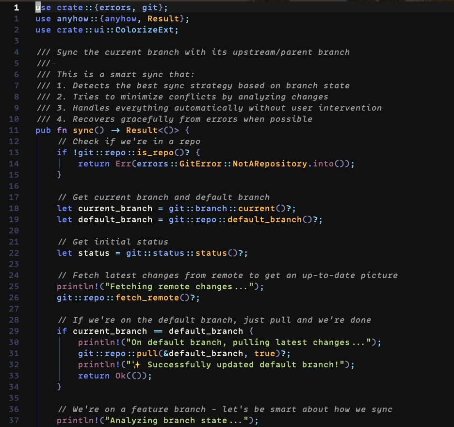

# lunaria-glow.nvim
Sexy theme

# 🌒 Lunaria Glow .nvim

> A dark, **WCAG‑AA**–compliant colour‑scheme for Neovim  
> now with an optional glassy background.

---



_Readability verified with WCAG contrast tests._

---

## ✨ Features

* **Pixel‑perfect match** to the Prism code‑block CSS in your docs/site.  
* Passes **4.5 : 1** contrast for every syntax colour on the default dark bg.  
* One‑line **transparent mode** for glass‑panel/VT backgrounds.  
* **Auto‑load**: `setup()` now calls `:colorscheme` for you (disable with `autoload = false`).
* Fast: pure Lua — no external deps, no runtime recolouring.

---

## 🛠 Installation

### lazy.nvim

```lua
{
  "foxycorps/lunaria_glow.nvim",
  priority = 1000,  -- load before anything that might set colours
  lazy     = false, -- make it your startup scheme
  opts = {
    transparent = true, -- theme options
  },
  config = function(_, opts)
    require("lunaria_glow").setup(opts)
  end,
}
```

### packer.nvim

```lua
use({
  "foxycorps/lunaria_glow.nvim",
  config = function()
    require("lunaria_glow").setup({ transparent = false })
  end,
})
```

### vim‑plug

```vim
Plug 'foxycorps/lunaria_glow.nvim'
let g:lunaria_glow_autoload = v:true " optional; set to v:false to require :colorscheme
let g:lunaria_glow_transparent = v:true " optional
```

---

## ⚙️ Configuration

| Option        | Type    | Default | Description                                                                    |
|---------------|---------|---------|--------------------------------------------------------------------------------|
| `transparent` | boolean | `false` | When `true`, sets the editor & sidebar background to **NONE** while retaining  |
|               |         |         | readable pop‑up selection colours.                                             |
| `autoload`    | boolean | `true`  | When `false`, `setup()` will **not** call `:colorscheme lunaria_glow`; you must apply it manually. |

With **transparent** enabled, ensure your terminal/GUI background is quite dark (`#1a1a1a`) or very light (`#f5f5f5`) to keep contrast.

---

## 🎨 Palette quick‑reference

| Role                 | Hex       |
|----------------------|-----------|
| Background           | `#111111` |
| Foreground           | `#eeeee1` |
| Keyword / operator   | `#6d89ff` |
| Number / literal     | `#ffb84a` |
| String / variable    | `#b3d77e` |
| Attribute / prop     | `#a36c8c` |
| Comment              | `#999999` |
| Punctuation / braces | `#cccccc` |
| Diff +               | `#76c490` |
| Diff –               | `#de7176` |

---

## 🧑‍💻 Contributing

PRs and issue reports welcome!  
*Got a language whose Tree‑sitter scopes need love?* — open an issue with a sample file.

1. Fork & clone the repo  
2. `nvim -u scripts/minimal_init.lua` to test  
3. Submit a PR with before/after screenshots.

---

## 📜 License

[MIT](LICENSE) © foxycorps.